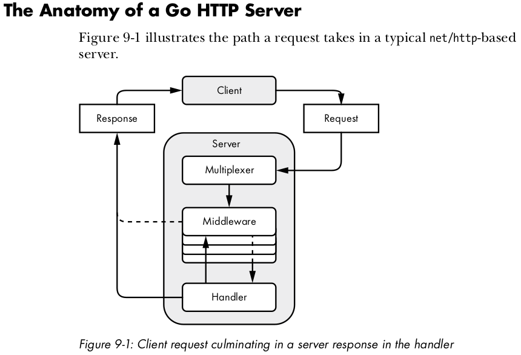

# utils-net


## Building http services
The `net/http` package handles most of the implementation details for you, so
you can focus on instantiating and configuring a server, creating resources,
and handling each client request.
In Go, an HTTP server relies on several interacting components: handles, 
middleware, and a multiplexer. 



### Handlers
When a client sends a request to an HTTP server, the server needs to figure
our what to do with it. The server may need to retrieve various resources or
perform an action, depending on what the client requests. You may have a handler
that knows how to retrieve an image and another that knows how to retrieve 
information from a database.
In Go, handlers are objects that implement the `http.Handler` interface. They
read client requests and write responses -> [example](http/handlers/default.go).

#### Injecting dependencies into Handlers
the http.Handler interface gives you access to the request and response objects.
But it's likely you'll require access to additional functionality like a logger,
metrics, cache, or database to handle a request. For example, you may want to
inject a logger to record request errors or inject a database object to retireve
data used to create the response. The easiest way to inject an object 
into a handler is by using a `closure`.
```Go
dbHandler := func(db *sql.DB) http.Handler {
    return http.HandlerFunc(
        func(w http.ResponseWriter, r *http.Request) {
            err := db.Ping()
            // do something with the database here..
        },
    )
}
http.Handle("/three", dbHandler(db))
// Or injecting dependencies into multiple handlers defined as struct methods
type Handlers struct {
    db *sql.Db 
    log *log.Logger
}
func (h *Handlers) Handler1() http.Handler {
    ...
}
```

### Middleware
Middleware comprises reusable functiions that accept an http.Handler and 
return an http.Handler.
You can use middleware to inspect the request and make decisions baased on its 
content before passing it along to the next handler. Or you might use the 
request content to set headers in the response. For example, the middleware could
respond to the client with an error if the handler requires authentication and
an unauthenticated client.
[middleware](http/middleware)

## [TFTP Server implementation](udp/tftp) 

Trivial File Transfer Protocol 
```sh
cd udp/tftp/example
go build tftp.go
sudo ./tftp
```

In other terminal use a TFTP client
```sh
tftp 
connect 127.0.0.1
binary
get file.jpeg
```

## [Unix Domain Sockets](unix_domain_socket) 

Stream based files can manage networks like tcp or udp but with a simple file.
Sockets for local interprcess communication that allows bidirectional data exhange
between processes running on the same machinel.
